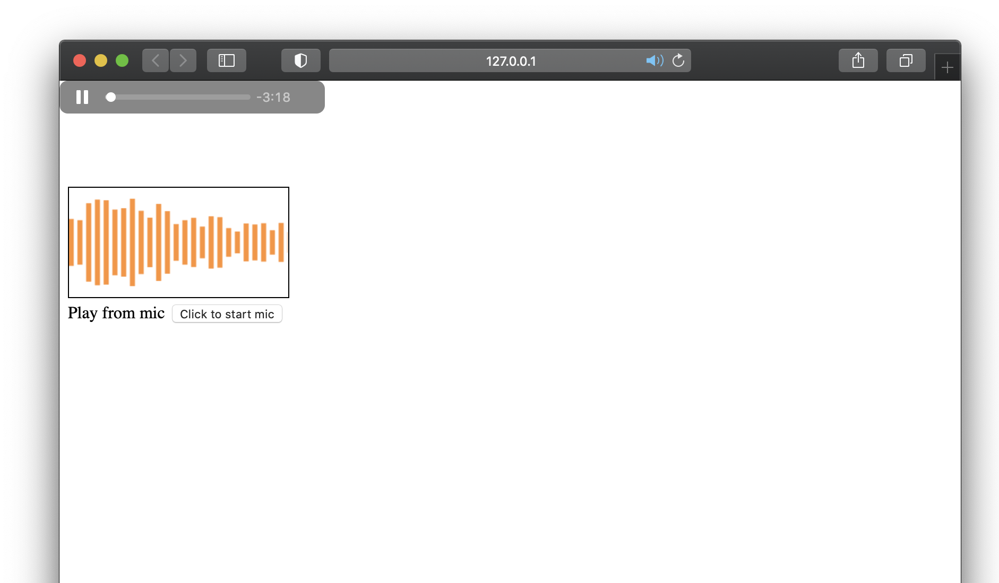

# [Wave.js](https://foobar404.github.io/Wave.js/#/)

Minimal wave visualizer for javascript from wave.js
Visual audio from element or micro phone stream



[DOCUMENTATION](https://foobar404.github.io/Wave.js/#/docs)

[LIVE EXAMPLES](https://foobar404.github.io/Wave.js/#/)

# Installation

<h3>Install with NPM</h3>

```html
npm i wave-visualizer
```

# Setup

<p>If your using npm use a default import to include wave.</p>

```javascript
import Wave from 'wave-visualizer';
```

<p>Create a new wave object.</p>

```javascript
var wave = new Wave();
```

<p>If your working with React, put the wave instance in state.</p>

```javascript
let [wave] = useState(new Wave());
```

# Usage

<p>Call one of the three main function on the wave object, fromFile, fromStream, fromElement.</p>

```javascript
wave.fromElement('audio_element_id', 'canvas_id');
```

# Documentation

<p>View the current documentation for Wave.js <a href="https://foobar404.github.io/Wave.js/#/docs" target="_blank">here</a>.</p>

<h1>Example</h1>

```html
<html>
  <head></head>

  <body>
    <canvas id="output" height="500" width="500"></canvas>

    <script src="../dist/bundle.cjs.js"></script>
    <script>
      let wave = new Wave();

      navigator.mediaDevices
        .getUserMedia({
          audio: true,
        })
        .then(function (stream) {
          wave.fromStream(stream, 'output', {
            colors: ['red', 'white', 'blue'],
          });
        })
        .catch(function (err) {
          console.log(err.message);
        });
    </script>
  </body>
</html>
```

# Contributor Workflow

<ol>
   <li>Fork Wave.js repo.</li>
   <li>Clone to your local computer.</li>
   <li>Run "npm i" in the root folder to install dependencies.</li>
   <li>Run "npm run test" to start the dev server and code watcher.</li>
   <li>Open the src folder and make a change to one of the src files.</li>
   <li>Save changes and refresh browser window to see changes.</li>
   <li>Push to remote branch and create a pull request to the Wave.js master branch.</li>
</ol>
